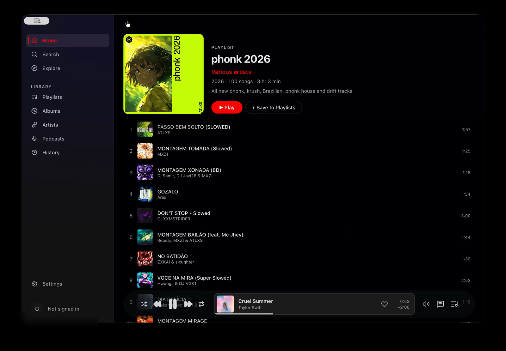

<p align="center">
  <video src="docs/screenshot-home.mp4" poster="docs/screenshot-home.png" width="800" autoplay loop muted playsinline controls>
    
  </video>
</p>

<p align="center">
  <a href="https://github.com/codeeatsleep2nd/VibeYTM/releases/latest"></a>
  
  <a href="LICENSE"></a>
</p>

# VibeYTM

A YouTube Music desktop app built with Tauri, React, and Rust.

## Features

- Liquid-glass UI: floating capsules for the player chrome, page title plates, and overlays — backdrop-filter + SVG displacement rims via `@liquidglass/react`
- YouTube-red accent (`#FF0000`) tuned in oklch, with a unified white-wash selection style across sidebar, mood pills, and search tabs
- Apple Music-style player chrome with foldable sidebar
- Now Playing page slides up smoothly from the bottom; lyrics is its own slide-from-right overlay (independent of the playing page) that frosts only its own card area
- Synced lyrics with karaoke-style highlighting (YTM timed lyrics → LRCLIB → NetEase fallback) and CJK pinyin romanization
- Per-track lyrics offset adjustment, manual lyrics refresh, lyrics pre-fetch for current and next tracks
- Playing queue with row alignment that mirrors the cover image's left edge, plus an artist context menu
- Album / playlist detail pages: pinned hero (cover + title + play-all + save), scrolling track list, edge-flush rows, invisible spacer so the last track clears the floating chrome
- Album hero meta line: `artist · year · N songs · runtime`; description joins all runs (no more lopped descriptions); back button portaled above the title-bar drag region for click reliability
- **Library Podcasts**: dedicated `FEmusic_library_non_music_audio_list` endpoint (full subscription list, not just the landing subset), per-show "last episode X ago" recency probe (parallel, capped concurrency, 1h localStorage cache), and grid sorted most-recent-first
- **Podcast detail rows** — full episode rows on show pages with the publish-date and long-form duration under the title plus a 3-line description preview, distinct from music-track rows
- **Subscribe / Unsubscribe button** on podcast detail pages with the same like-endpoint round-trip as playlist/album save
- Show-cover override: episodes from a podcast use the show's channel art on every now-playing surface
- **Direct Google sign-in** — first-launch login surface auto-opens the auxiliary YTM window straight on Google's account chooser; bridge auto-detects sign-in (DOM avatar + SAPISID cookie) and the boot orchestrator hides the window the moment it's reached the app phase. Settings → "Sign in to YouTube Music" uses the same direct URL.
- **Focus timer overlay** — clock button in the player chrome opens a full-page focus surface mirroring the Now Playing style; 5–120 min slider in 5-min steps, default 25 min. macOS system notification + custom "happy bells" sound on completion (sound bundled into the binary via `include_bytes!`). App-level confirmation gate prompts before any close path while the countdown is running. Slider becomes interactive again on Done — clicking it returns to idle with the new duration.
- **Pinned Home shelves** — Listen again, Your daily discover, Albums for you stay at the top of Home no matter what order YTM returns them in
- **Grouped History** — recently played is bucketed into Today / Yesterday / This week / Earlier (preserving YTM's own date sections under the hood)
- **Expandable hero descriptions** — long album / show / playlist descriptions clamp to 2 lines with a More / Less toggle that only appears when text actually overflows
- System tray with playback controls
- Media key support (Play/Pause, Next, Previous)
- Now Playing Control Center integration (macOS)
- Desktop notifications on track change
- Global keyboard shortcuts (configurable, with `⌘/` cheatsheet)
- Audio counterpart detection — always shows album art, never video thumbnails
- Session persistence — resumes last track and position on restart
- Search history — last 5 queries as quick-tap chips
- Blur-and-spinner reload UX
- Disk-cache stats in Settings with one-click clear
- Custom About window with version info

## Screenshots

<p align="center">
  <video src="docs/screenshot-home.mp4" poster="docs/screenshot-home.png" width="800" autoplay loop muted playsinline controls>
    
  </video>
</p>

## Tech Stack

| Component | Technology |
|-----------|-----------|
| Framework | Tauri 2.x |
| Backend | Rust |
| Frontend | React 19 + TypeScript |
| Build | Vite |
| Audio Engine | YouTube Music (hidden WebView) |
| Bundle Size | ~4 MB |

## Installation

### Download

Download the latest `.dmg` from the [Releases page](https://github.com/codeeatsleep2nd/VibeYTM/releases/latest).

> **macOS Gatekeeper:** After installing, run `xattr -cr /Applications/VibeYTM.app` in Terminal if macOS says the app is damaged.

### Build from Source

Prerequisites:
- Rust (rustup)
- Node.js 20+
- pnpm

```bash
git clone https://github.com/codeeatsleep2nd/VibeYTM.git
cd VibeYTM
pnpm install
pnpm tauri build
```

The built app will be at `src-tauri/target/release/bundle/macos/VibeYTM.app`.

## Development

```bash
pnpm install
pnpm tauri dev
```

## Architecture

VibeYTM uses a two-WebView architecture:

1. **Visible WebView** — Custom React UI
2. **Hidden WebView** — YouTube Music web player (audio engine only)

The Rust backend acts as the bridge:
- Event bus (tokio broadcast) connects all components
- Plugin-based integrations (each implements an `Integration` trait)
- PlayerState is the single source of truth

See [DESIGN.md](DESIGN.md) for the full system design.

## Project Structure

```
vibeytm/
├── src/                    # React frontend
│   ├── components/         # UI components (layout, player, browse, pages)
│   ├── hooks/              # React hooks (player state, lyrics, login, seek filter)
│   ├── lib/                # Types, IPC wrappers, events, caches
│   └── styles/             # CSS tokens + global styles
├── src-tauri/              # Rust backend
│   └── src/
│       ├── commands/       # Tauri IPC commands
│       ├── events/         # Event bus
│       ├── integrations/   # Media controls, notifications, global shortcuts
│       ├── state/          # PlayerState, AppSettings
│       ├── tray/           # System tray
│       ├── ytm_api/        # YouTube Music API client
│       └── webview_bridge/ # Hidden WebView management
└── scripts/inject/         # JS bridge for YouTube Music player
```

## License

MIT

## Disclaimer

VibeYTM is an unofficial application and is not affiliated with YouTube or Google Inc. "YouTube", "YouTube Music" and the "YouTube Logo" are registered trademarks of Google Inc.
